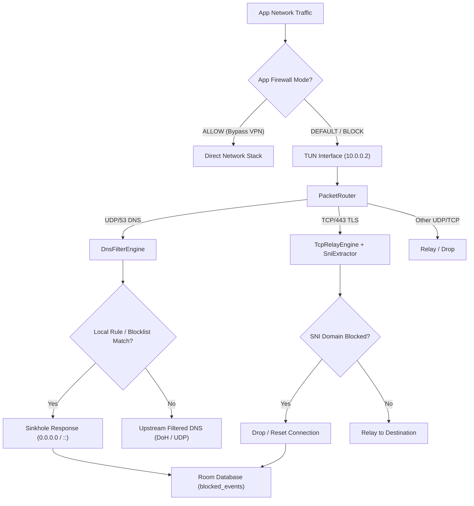

# NexusBlock Codebase Explainer & AI Developer Guide

Welcome, AI Developer. This document is a complete, self-contained technical specification of **NexusBlock** — a root-free, device-wide ad-blocker built for Android TV (and mobile). It covers the architecture, packet mechanics, file-by-file APIs, data schemas, sequence flows, and build steps you need to start working on, modifying, and extending this codebase.

---

## 1. Core Architecture & System Overview

NexusBlock achieves root-free, system-wide ad-blocking by combining an Android `VpnService` with a custom user-space packet router, local DNS interceptor, and encrypted upstream DNS resolution.



### Key Engineering Paradigms

1. **Local VPN TUN with Selective Routing**  
   `NexusVpnService` creates a TUN interface (`10.0.0.2/24`) and routes traffic through it. Apps marked `ALLOW` in the firewall are excluded via `addDisallowedApplication()`. The routing mode can be DNS-only or full-tunnel depending on aggressiveness settings.

2. **Upstream Filtered DNS (Primary Defense)**  
   Rather than maintaining massive local blocklists, the app delegates to upstream filtered resolvers (AdGuard DNS, Cloudflare Family, Quad9, etc.) over DNS-over-HTTPS (DoH). This gives ~3M+ daily-updated block rules with near-zero local memory cost.

3. **Local Custom Rules + Emergency Blocks**  
   `DnsFilterEngine` still evaluates local custom rules and a small built-in emergency list for Indian OTT domains that upstream lists may miss.

4. **SNI Inspection for Encrypted Traffic**  
   `TcpRelayEngine` performs split-TCP termination. `SniExtractor` parses the unencrypted TLS `ClientHello` to extract the SNI hostname. Known ad-serving CloudFront distributions are blocked at the SNI level (Prime Video SSAI defeat).

5. **QUIC Downgrade Strategy**  
   DNS SVCB/HTTPS records for streaming CDN domains are blocked, forcing apps to fall back to TCP/443 where SNI inspection is possible.

---

## 2. Directory Map

```
com.nexusblock/
├── Constants.kt                  # Global constants: IPs, ports, blocklist URLs, notification IDs
├── NexusBlockApplication.kt      # Application class (Hilt entry point)
├── cert/
│   └── LunaCertInstaller.kt      # Exports Luna CA cert to Downloads for manual install
├── data/db/
│   ├── AppDatabase.kt            # Room database (blocked_domains, blocked_events, custom_rules)
│   ├── BlockedDomainDao.kt
│   ├── BlockedEventDao.kt
│   └── CustomRuleDao.kt
├── data/model/
│   ├── BlockedDomain.kt
│   ├── BlockedEvent.kt
│   ├── CustomRule.kt
│   └── FirewallMode.kt           # DEFAULT / ALLOW / BLOCK enum
├── data/repository/
│   ├── SettingsRepository.kt     # DataStore Preferences (VPN state, techniques, firewall modes, DNS profile)
│   ├── BlocklistRepository.kt    # Room-backed blocklist source management
│   ├── StatsRepository.kt        # Aggregates blocked event logs
│   ├── CustomRuleRepository.kt
│   ├── RawBlocklistLoader.kt     # Parses raw blocklist files
│   ├── BlocklistParsers.kt       # HOSTS and AdGuard-syntax parsers
│   ├── BlocklistSources.kt       # URLs and metadata for remote blocklists
│   └── BuiltInBlockRules.kt      # Hard-coded emergency rules
├── data/worker/
│   └── BlocklistUpdateWorker.kt  # WorkManager periodic update of remote blocklists
├── di/
│   ├── AppModule.kt              # Hilt: DataStore, SharedPreferences, OkHttpClient
│   └── DatabaseModule.kt         # Hilt: Room database + DAOs
├── engine/
│   ├── PacketRouter.kt           # Reads TUN fd, dispatches UDP/TCP/ICMP packets
│   ├── DnsFilterEngine.kt        # DNS resolution: cache → local rules → upstream DoH
│   ├── RuleEngine.kt             # AdGuard-syntax domain matching + CIDR IP blocking
│   ├── TcpRelayEngine.kt         # Split-TCP relay with SNI extraction
│   ├── UdpRelayEngine.kt         # UDP packet relay through VPN
│   ├── SniExtractor.kt           # Parses TLS ClientHello for SNI hostname
│   ├── VpnProtector.kt           # Protects sockets from VPN loopback
│   ├── VpnProtectedSocketFactory.kt # OkHttp SocketFactory using VpnProtector
│   └── dns/
│       ├── DnsUpstreamManager.kt # DoH / DoT / plain UDP resolver with fallback
│       ├── DnsProfileManager.kt  # Manages provider profiles (AdGuard, Cloudflare, etc.)
│       ├── DnsProviderProfile.kt
│       └── BootstrapDns.kt       # Prevents DoH hostname resolution loops
├── service/
│   ├── NexusVpnService.kt        # Android VpnService: TUN setup, foreground notification
│   ├── VpnWatchdogService.kt     # AlarmManager-based watchdog to restart crashed VPN
│   ├── BootReceiver.kt           # Restores VPN on BOOT_COMPLETED if auto-start enabled
│   └── UninstallCleanupReceiver.kt # Cleans up on package removal / suspension
├── ui/
│   ├── MainActivity.kt           # Root Compose activity + NavHost (3 routes)
│   ├── Screen.kt                 # Sealed class for navigation routes
│   ├── components/
│   │   ├── NexusTvComponents.kt  # Navigation rail, buttons, cards, focus handling
│   │   ├── Animations.kt         # AnimatedCounter, shimmerBrush, vignette
│   │   └── TvBottomNavigation.kt # Bottom nav (alternative to rail)
│   ├── screens/
│   │   ├── DashboardScreen.kt    # VPN toggle, stats, shield animation, bandwidth
│   │   ├── SettingsScreen.kt     # DNS provider, routing mode, auto-start, Luna CA install
│   │   ├── AdvancedSettingsScreen.kt # Inline tabs: Techniques, Blocklists, Rules, Firewall
│   │   └── LogsScreen.kt         # Blocked event list with filter and clear
│   ├── theme/
│   │   ├── Theme.kt              # MaterialTheme + TV dimensions
│   │   ├── Type.kt               # Dubai font family typography
│   │   └── Dimensions.kt         # Responsive dimension provider for TV widths
│   └── viewmodel/
│       ├── DashboardViewModel.kt
│       ├── SettingsViewModel.kt
│       ├── BlocklistViewModel.kt
│       ├── CustomRulesViewModel.kt
│       ├── FirewallViewModel.kt
│       └── LogsViewModel.kt
```

---

## 3. Navigation & Screens

`MainActivity` hosts a single `NavHost` with **3 top-level routes**:

| Route | Screen | Purpose |
|-------|--------|---------|
| `home` | `DashboardScreen` | VPN toggle, shield animation, blocked count, data saved, active rules, bandwidth |
| `activity` | `LogsScreen` | Recent blocked events with filter/clear actions |
| `settings` | `SettingsScreen` | Auto-start, DNS provider, routing mode, Luna CA install, battery optimization |

`AdvancedSettingsScreen` is **not a NavHost route** — it is an inline tabbed panel embedded inside `SettingsScreen` with 4 tabs:
- **Techniques** — Toggle live blocking features (DNS, Header, IP, Stealth, Firewall)
- **Blocklists** — Enable/disable remote blocklist sources + manual update
- **Rules** — User-defined custom block/allow rules with AdGuard syntax
- **Firewall** — Per-app VPN bypass and DNS-block modes

---

## 4. Architecture Layers

### UI Layer
- **Jetpack Compose + TV Material3** for Android TV-optimized UI
- `StateFlow` + `collectAsState()` for reactive state
- `SharingStarted.WhileSubscribed(5000)` for lifecycle-aware upstream collection
- `hiltViewModel()` for DI-scoped ViewModels

### ViewModel Layer
- `DashboardViewModel`: Combines VPN state, stats, blocklist domain count, and bandwidth into an immutable `DashboardUiState`
- `SettingsViewModel`: Wraps `SettingsRepository` for reactive settings UI
- `BlocklistViewModel`, `CustomRulesViewModel`, `FirewallViewModel`: Manage inline tab content in AdvancedSettings
- `LogsViewModel`: Observes `BlockedEventDao` with filtering

### Repository Layer
- `SettingsRepository`: `DataStore<Preferences>` for all user settings. Hot `StateFlow`s for synchronous + reactive access.
- `BlocklistRepository`: Room-backed. Stores domains from remote sources with per-source enable toggles.
- `StatsRepository`: Batched logging of blocked events to Room.
- `CustomRuleRepository`: CRUD for user custom rules.

### Engine Layer
```
PacketRouter (IO coroutine, reads TUN fd)
├── UDP/53 → DnsFilterEngine
│   ├── LRU Cache (4096 entries)
│   ├── Negative Cache (SERVFAIL/NXDOMAIN, 60s)
│   ├── Local RuleEngine (custom rules + blocklists)
│   └── DnsUpstreamManager (DoH → DoT → plain UDP fallback)
├── TCP/443 → TcpRelayEngine
│   └── SniExtractor (TLS ClientHello parsing)
│   └── Block if domain/IP matches or unknown CloudFront dist
└── Other → UdpRelayEngine / relay or drop
```

### Service Layer
- `NexusVpnService`: Establishes TUN, manages `PacketRouter`, foreground notification
- `VpnWatchdogService`: `AlarmManager`-based health check every 30s. Restarts VPN if expected but not running.
- `BootReceiver`: Restores VPN state after reboot if `auto_start` and `vpn_active` are true.

---

## 5. Feature Inventory (Live)

| Feature | Implementation | Configurable |
|---------|---------------|--------------|
| Local VPN ad-blocking | `NexusVpnService` + `PacketRouter` + `DnsFilterEngine` | Always on when VPN active |
| DNS filtering | `DnsFilterEngine` upstream DoH + local rules | Toggle: "DNS Filtering" |
| Header filter | `BlockingTechniques.headerFilter` | Toggle: "Header Filter" |
| IP blocking | `RuleEngine.isIpBlocked()` + CIDR matching | Toggle: "IP Blocking" |
| Stealth mode | Drops ICMP in `PacketRouter` if enabled | Toggle: "Stealth Mode" |
| App Firewall | Per-package `FirewallMode` via `SettingsRepository` | Toggle: "App Firewall" + per-app selector |
| Luna IKEv2 failover | `LunaVpnManager` + `VpnFailoverController` | `VpnMode` enum (Luna primary / local only / Luna only) |
| SNI inspection | `TcpRelayEngine` + `SniExtractor` | Always active during full-tunnel |
| QUIC downgrade | Block SVCB/HTTPS records for CDN domains | Always active |
| Custom rules | `CustomRuleDao` + `RuleEngine` | User-managed in AdvancedSettings |
| Blocklist management | `BlocklistUpdateWorker` + `BlocklistRepository` | Per-source toggles + manual update |
| Boot auto-start | `BootReceiver` | Toggle in Settings |
| Watchdog | `VpnWatchdogService` | Always active when VPN enabled |

### Removed / Not Implemented
The following features exist in design docs or forks but are **not present** in this codebase:
- **SNI Watch toggle** — SNI inspection is automatic in full-tunnel mode; no user toggle exists
- **HTTPS Proxy / MITM** — No proxy server, no certificate interception, no `LittleProxy`
- **Albania Mode** — No region-spoofing logic; upstream DNS handles geo-specific blocking

---

## 6. Data Flows

### DNS Query Path
```
App → TUN (10.0.0.1:53) → PacketRouter → DnsFilterEngine.resolveDns()
  1. Check LRU cache → return instantly
  2. Check negative cache → return SERVFAIL instantly
  3. Critical-allow list → plain DNS bypass (bypass filtered upstream for video domains)
  4. Local RuleEngine block check → sinkhole (0.0.0.0 / ::)
  5. Upstream filtered DoH (AdGuard/Cloudflare/Quad9) → cache + return
```

### Blocklist Update Flow
```
WorkManager (24h periodic)
  → BlocklistUpdateWorker.doWork()
    → Fetch each enabled remote source (OkHttp)
    → Parse (HOSTS or AdGuard syntax)
    → Store in Room (blocked_domains table)
    → If VPN running: DnsFilterEngine.reloadRules()
```

### Boot Restore Flow
```
BOOT_COMPLETED → BootReceiver.onReceive()
  → If auto_start && vpn_active:
    → startForegroundService(NexusVpnService)
    → VpnWatchdogService.start()
```

---

## 7. Storage & Data Schemas

### Room Database (`AppDatabase`)

**`blocked_domains`**
| Column | Type | Notes |
|--------|------|-------|
| `id` | Int PK | Auto-increment |
| `host` | String | Unique index |
| `source` | String | Blocklist source ID |
| `enabled` | Boolean | Per-source toggle |
| `isRegex` | Boolean | For custom rules |
| `regexPattern` | String? | Nullable regex |
| `insertedAt` | Long | Unix timestamp |

**`custom_rules`**
| Column | Type | Notes |
|--------|------|-------|
| `id` | Int PK | Auto-increment |
| `rule` | String | Unique; `||domain^`, `@@domain^`, `/regex/` |
| `isAllow` | Boolean | Exception rule flag |
| `enabled` | Boolean | User toggle |
| `description` | String? | Nullable |
| `createdAt` | Long | Unix timestamp |

**`blocked_events`**
| Column | Type | Notes |
|--------|------|-------|
| `id` | Int PK | Auto-increment |
| `host` | String | Blocked domain |
| `appPackage` | String? | Originating package (if known) |
| `type` | String | `dns`, `dns-svcb`, `dns-cname`, `sni`, `ip` |
| `timestamp` | Long | Unix timestamp |

### DataStore Preferences

| Key | Type | Default | Description |
|-----|------|---------|-------------|
| `auto_start` | Boolean | `true` | Restart VPN on boot |
| `battery_opt` | Boolean | `false` | Ignore battery optimizations flag |
| `vpn_active` | Boolean | `false` | User desires VPN on |
| `vpn_routing_mode` | String | `full_route_aggressive` | DNS-only / full-route-safe / full-route-aggressive |
| `vpn_mode` | String | `luna_primary` | Luna+Local / Local-only / Luna-only |
| `dns_profile` | String | `adguard_standard` | Selected upstream DNS provider |
| `tech_dns` | Boolean | `true` | DNS Filtering toggle |
| `tech_header` | Boolean | `true` | Header Filter toggle |
| `tech_ip` | Boolean | `true` | IP Blocking toggle |
| `tech_stealth` | Boolean | `false` | Stealth Mode toggle |
| `tech_firewall_v2` | Boolean | `false` | App Firewall toggle |
| `firewall_modes_json` | String | `{}` | JSON map of package → `DEFAULT`/`ALLOW`/`BLOCK` |

---

## 8. Testing

Existing unit tests in `app/src/test/java/com/nexusblock/`:

| Test | Coverage |
|------|----------|
| `RuleEngineTest.kt` | Domain matching, exception rules (`@@`), regex, CIDR, hosts parser |
| `IpFlowKeyTest.kt` | Flow key hashing and equality for IPv4/IPv6 |
| `PendingByteQueueTest.kt` | Byte queue buffer coalescing |
| `VpnRoutingModeTest.kt` | Serialization of `VpnRoutingMode` enum |

Run:
```bash
./gradlew test
```

---

## 9. Build & Dependencies

**Build**: Gradle Kotlin DSL (`build.gradle.kts`)
**Kotlin**: 2.0.21
**AGP**: 8.9.1

**Notable Libraries**:
- Jetpack Compose (UI, Navigation, TV Material3)
- Hilt (DI)
- Room (local DB)
- DataStore Preferences
- WorkManager (periodic blocklist updates)
- OkHttp (DoH queries, blocklist downloads)
- dnsjava (`org.xbill.DNS`) (DNS packet parsing)
- Kotlinx Coroutines

**Build Commands**:
```bash
./gradlew clean assembleDebug
./gradlew test
adb install -r app/build/outputs/apk/debug/app-debug.apk
```

**Logcat Filters**:
```bash
adb logcat -s NexusBlock/VPN
adb logcat -s NexusBlock/Router
adb logcat -s NexusBlock/DNS
adb logcat -s NexusBlock/Relay
```

---

## 10. Guidelines for AI Code Modifications

### Rules for Engine Code
1. **Never block the packet loop**: `PacketRouter` reads from the TUN fd in a tight IO coroutine. Expensive work (DB queries, regex compilation) must be offloaded to `Dispatchers.Default` or pre-computed.
2. **Cache aggressively**: DNS is queried hundreds of times per minute. The LRU cache and negative cache are critical for performance.
3. **Protect outbound sockets**: Any socket that talks to the real internet must call `VpnProtector.protect()` before connecting, or the packet will loop back into the TUN.
4. **Avoid default routes without a full stack**: Do not add `0.0.0.0/0` to the TUN builder unless `TcpRelayEngine` and `UdpRelayEngine` are fully ready to handle all protocols.

### UI Rules
1. **Use `tvDimensions()` for spacing**: Do not hardcode TV-unsafe padding. The dimension provider scales based on screen width.
2. **Respect focus**: All interactive elements must be focusable on TV (D-pad navigation).
3. **StateFlow snapshots**: Prefer single immutable UI-state objects over many individual `remember` pieces to minimize recompositions.
