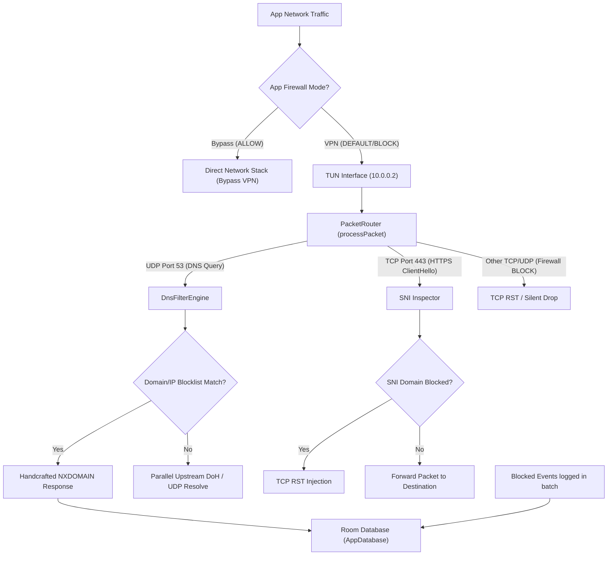
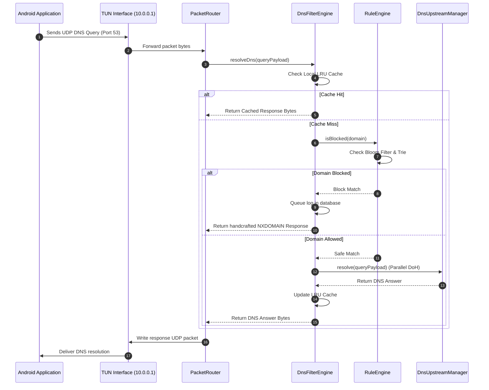
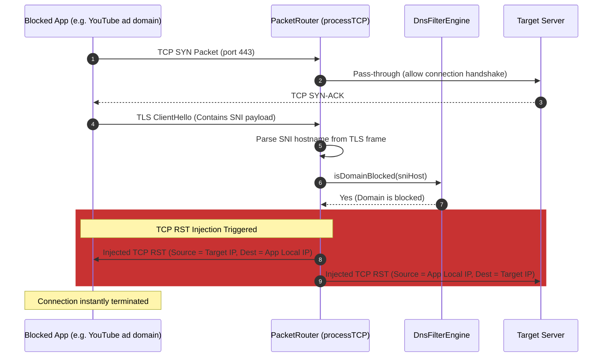
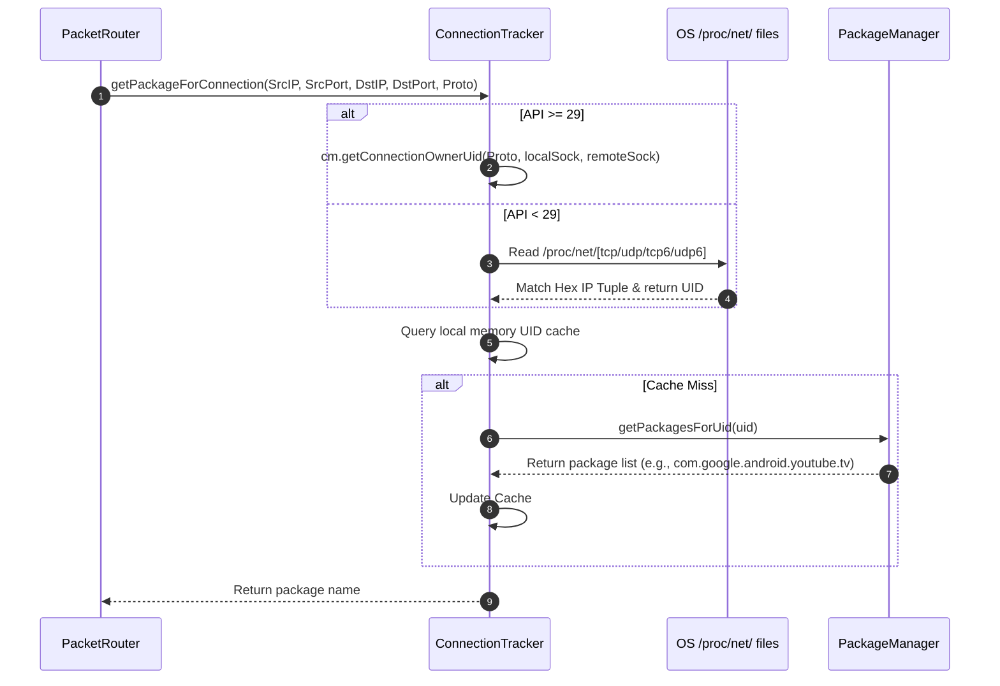

# NexusBlock Codebase Explainer & AI Developer Guide

Welcome, AI Developer. This document is a complete, self-contained, high-fidelity technical specification of **NexusBlock**—a root-free, device-wide ad-blocker and firewall tailored for Android TV and Mobile devices. It contains everything you need to know about the architecture, low-level packet mechanics, file-by-file APIs, data schemas, sequence flows, and build steps to start working on, modifying, and extending this codebase immediately.

---

## 1. Core Architecture & System Overview

NexusBlock achieves root-free, system-wide ad-blocking and firewalling by combining an Android `VpnService` with a custom user-space packet router, local DNS interceptor, unencrypted SNI packet inspector, and a local MITM HTTPS proxy.



### Key Engineering Paradigms & Optimizations

1. **The DNS-Routing Trick (Zero-Bottleneck Performance)**:
   Unlike standard VPNs that route all device traffic (`0.0.0.0/0`) through the virtual interface, NexusBlock only sets a route to the local virtual DNS server IP: `10.0.0.1/32` (via `addRoute("10.0.0.1", 32)`).
   * **Why**: Only DNS packets enter the TUN interface. Standard application traffic (video streams, images, downloads) bypasses the VPN completely at full hardware speed, avoiding routing loops, memory overhead, and CPU heating.
   * **Exceptions**: When an app is placed in `BLOCK` firewall mode, its entire traffic routing is captured by the VPN so it can be dropped at the packet level.

2. **Per-App Firewall Loop & Uid Mapping**:
   * **ALLOW (Bypass)**: The package is passed to `addDisallowedApplication(pkg)`. The operating system routes its traffic completely outside the VPN.
   * **BLOCK (Internet Denied)**: The package is *not* disallowed, meaning its traffic flows into the TUN. The `PacketRouter` matches the connection socket to a UID and package using `ConnectionTracker`. If it matches a blocked package, `PacketRouter` intercepts DNS queries with an instant `NXDOMAIN` and drops TCP/UDP streams using injected `TCP RST` packets or silent drops.

3. **Hybrid DNS Engine with Parallel Resolver**:
   * Intercepted DNS queries are parsed using `dnsjava`.
   * The resolver uses a tiered pipeline: LRU Cache (1000 entries) $\rightarrow$ Rule Engine (AdGuard syntax + Bloom filter + Domain Trie) $\rightarrow$ Upstream parallel lookup (DNS-over-HTTPS via OkHttp and Plain UDP resolver).
   * To prevent apps from bypassing local filtering, DNS-over-HTTPS endpoints (like `cloudflare-dns.com`) are explicitly blocked at the DNS level.

4. **YouTube Ad Blocking Mechanics**:
   * **SNI Inspection**: YouTube utilizes SSL pinning, meaning full HTTPS MITM decryption fails. Instead, the `PacketRouter` parses the unencrypted TLS `ClientHello` handshake, extracts the SNI hostname, and injects a raw `TCP RST` packet before the TLS handshake completes.
   * **Custom WebView skipping**: In the UI, a custom YouTube player utilizes the official YouTube IFrame API and custom JS injection inside a WebView to strip ads on the fly.

---

## 2. Module-by-Module Technical Breakdown

### Core Constants: `com.nexusblock.Constants`
Contains global constants for networking, notification channels, preference keys, and default blocklists.
* **Ports**: MITM Proxy port is `8123`. VPN TUN MTU is `1500`.
* **Default Blocklist URLs**:
  * AdGuard: `https://adguardteam.github.io/AdGuardSDNSFilter/Filters/filter.txt`
  * OISD Big: `https://big.oisd.nl/`
  * StevenBlack: `https://raw.githubusercontent.com/StevenBlack/hosts/master/hosts`

### Dependency Injection Modules (`di/`)
* **`AppModule.kt`**:
  * `provideDataStore`: Creates the Preference DataStore instance with SharedPreferences migration backing `nexusblock_settings`.
  * `provideSharedPreferences`: Legacy fallback editor.
  * `provideOkHttpClient`: Configures standard network client with 30s timeouts and basic interceptor logging.
* **`DatabaseModule.kt`**:
  * `provideDatabase`: Builds Hilt-managed SQLite Room Database `nexusblock.db` with destructive migrations enabled for rapid schema changes.
  * Provides DAOs: `BlockedDomainDao`, `BlockedEventDao`, `CustomRuleDao`.

---

### Low-Level Packet Engine (`engine/`)

#### 1. `PacketRouter.kt`
The brain of the user-space VPN tunnel. It reads IP packets from the TUN `FileDescriptor` and processes them in an IO-bound coroutine loop.

* **Primary APIs**:
  * `start(vpnService, tunFd, dnsAddress)`: Initiates coroutine worker reading from a `FileInputStream(tunFd)` channel.
  * `stop()`: Resets diagnostic counters and cancels jobs.
* **Packet Processing**:
  * Checks IP headers (IPv4 version byte shift: `version = buffer.get(0) shr 4 and 0x0F`).
  * **ICMP**: If stealth mode is enabled, drops ICMP packets.
  * **UDP**: Intercepts port 53 traffic, parses query via `DnsFilterEngine`, and injects response.
  * **TCP**: Intercepts port 443. Parses TLS `ClientHello` unencrypted frames (ContentType `22`, HandshakeType `1`). If SNI matches a blocked domain, drops the packet and injects a custom-crafted `TCP RST` packet.
* **Low-Level Helper Methods**:
  * `sendRst(...)`: Hand-crafts a TCP packet with `RST` flag set (`0x04`) and swaps the source/destination IPs and ports. Computes IP/TCP checksums using 16-bit word binary sums.
  * `sendDnsResponse(...)`: Hand-crafts a UDP packet wrapping the serialized `dnsjava` DNS payload and swaps addresses.

#### 2. `DnsFilterEngine.kt`
Evaluates, caches, and routes DNS queries.
* **Primary APIs**:
  * `resolveDns(queryPayload: ByteArray): ByteArray?`: Processes raw DNS packet bytes, checks the Bloom filter, traverses the subdomain trie, queries cache, and coordinates upstream lookups.
  * `reloadBlocklists()`: Pulls enabled remote domains and custom database rules, compiles them into a fresh `RuleEngine`, and purges the DNS cache.
* **Special Whitelists**:
  * `YOUTUBE_WHITELIST_RULES`: Hard-coded set of domains whitelisted to keep YouTube recommendations working (`youtubei.googleapis.com`, `ytimg.com`, `accounts.google.com`) while allowing video ad-block filters to target video servers.

#### 3. `RuleEngine.kt` & `BloomFilter.kt`
Combines a Bloom Filter for O(1) negative caching and a reversed-subdomain suffix Tree (Trie) for wildcard matching.
* **Bloom Filter**: Evaluates string hash values using custom bitwise iterations over an 8-Million bit `java.util.BitSet`.
* **Domain Trie**: Subdomains are split by dot (`.`) and inserted in **reversed order** (e.g. `ads.google.com` $\rightarrow$ `com` $\rightarrow$ `google` $\rightarrow$ `ads`). This allows O(N) lookup where N is the label depth of the query.

#### 4. `ConnectionTracker.kt`
Resolves TCP/UDP sockets to package names.
* **Android 10+ (API 29+)**: Queries `ConnectivityManager.getConnectionOwnerUid(IPPROTO, localSocket, remoteSocket)`.
* **Android 9 and below**: Parses `/proc/net/tcp`, `/proc/net/tcp6`, `/proc/net/udp`, and `/proc/net/udp6` in real-time, matching hex IP tuples.
* **Package Resolution**: Translates UID to Package Name using `packageManager.getPackagesForUid(uid)`.

#### 5. `MitmProxyManager.kt` & `CertificateManager.kt`
Manages the local HTTP/HTTPS MITM Proxy.
* **`MitmProxyManager`**: Bootstraps Netty-based `LittleProxy` on `127.0.0.1:8123`. Filters requests by evaluating URL paths (`/youtubei/v1/ads`, `/pagead`) and host regexes. Intercepted ads receive an instant `HTTP 204 No Content` response.
* **`CertificateManager`**: Uses BouncyCastle to generate a 2048-bit RSA CA certificate (`nexusblock-ca.crt`) and signs dynamic domain leaf certificates on-the-fly for decrypting HTTPS streams.

---

### Android Core Services (`service/`)

#### 1. `NexusVpnService.kt`
Extends `VpnService`. Manages TUN setup and OS network callbacks.
* **TUN Setup**: MTU 1500, IP `10.0.0.2/24`, Route `10.0.0.1/32` (DNS).
* **Firewall Isolation**: Adds disallowed packages using `builder.addDisallowedApplication(pkg)`.
* **Connectivity Monitoring**: Registers `ConnectivityManager.NetworkCallback` to detect underlying network changes (Wi-Fi $\leftrightarrow$ Mobile) and triggers a debounced VPN restart to keep routing tables valid.

#### 2. `VpnWatchdogService.kt` & `BootReceiver.kt`
* **Watchdog**: Periodically checks `NexusVpnService.isRunning`. If the VPN crashed, restarts it foreground. Schedules `AlarmManager.setExactAndAllowWhileIdle` as a fallback to survive system deep doze.
* **BootReceiver**: BroadcastReceiver for `BOOT_COMPLETED` that automatically restarts the VPN on device boot if auto-start is toggled on.

---

## 3. Key Network & Process Flows

### Intercepted DNS Query Resolution



### SNI Interception and TCP RST Injection



### Connection Owner App Attribution



---

## 4. Storage & Data Schemas

### SQLite Room Database Schema (`AppDatabase`)

#### Table: `blocked_domains`
Stores list of domains from downloaded blocklists.
* **`id`**: Integer Primary Key Auto-Increment.
* **`host`**: Text (Unique index for fast matching).
* **`source`**: Text (Index; remote blocklist identifier).
* **`enabled`**: Integer (Boolean toggle).
* **`isRegex`**: Integer (Boolean for custom regex matches).
* **`regexPattern`**: Text (Nullable regex pattern string).
* **`insertedAt`**: Integer (Unix timestamp).

#### Table: `custom_rules`
Stores custom block/allow rules added by the user.
* **`id`**: Integer Primary Key Auto-Increment.
* **`rule`**: Text (Unique index; supports domains, prefixes `|`, wildcards `||`, exceptions `@@`).
* **`isAllow`**: Integer (Boolean; 1 = Exception rule, 0 = Block rule).
* **`enabled`**: Integer (Boolean toggle).
* **`description`**: Text.
* **`createdAt`**: Integer (Unix timestamp).

#### Table: `blocked_events`
Database log for blocked connection attempts.
* **`id`**: Integer Primary Key Auto-Increment.
* **`host`**: Text (Index).
* **`appPackage`**: Text (Index; stores app package that initiated query).
* **`type`**: Text (`dns`, `sni`, `https`).
* **`timestamp`**: Integer (Index; Unix timestamp).

---

### Preferences DataStore Schema

Key settings are stored in `DataStore<Preferences>` and serialized to XML/JSON:
1. **`firewall_modes_json`**: String JSON representing packet-blocking modes.
   ```json
   {
     "com.example.analyticsapp": "BLOCK",
     "com.netflix.mediaclient": "ALLOW",
     "com.android.youtube.tv": "DEFAULT"
   }
   ```
2. **Blocking Techniques (`BlockingTechniques`)**:
   * `tech_dns`: Boolean (Enable DNS filter engine).
   * `tech_sni`: Boolean (Enable SNI TLS unencrypted parsing).
   * `tech_mitm`: Boolean (Enable LittleProxy HTTPS proxy).
   * `tech_header`: Boolean (Enable custom HTTP header stripping).
   * `tech_ip`: Boolean (Enable CIDR and IP-level blacklists).
   * `tech_stealth`: Boolean (Enable ICMP drop).
   * `tech_firewall_v2`: Boolean (Enable App Firewall uid matching).

---

## 5. Guidelines for AI Code Modifications

### Rules for Modifying Network Code
1. **Never perform blocking operations in the packet loop**: The `PacketRouter` loop processes thousands of packets per second. Heavy Room DB operations, network tasks, or expensive regular expressions *must* be scheduled off-thread using asynchronous Coroutines (`scope.launch`).
2. **Byte Buffer Thread-Safety**: When sending generated UDP/TCP response packets, lock the channel writes to avoid concurrent write crashes:
   ```kotlin
   synchronized(outputLock) {
       output.write(packet)
   }
   ```
3. **Keep the VPN DNS Route Isolated**: Do **not** attempt to add a default route `0.0.0.0/0` unless you have explicitly coded a full TCP/UDP stack handler (e.g. using Netty or `tun2socks` emulation). Adding `0.0.0.0/0` without a local NAT/TCP reassembler will completely break network routing.

### Build and Compilation Commands

The project uses Gradle Kotlin DSL.
* **Clean & Build**:
  ```powershell
  ./gradlew clean assembleDebug
  ```
* **Run Unit Tests**:
  ```powershell
  ./gradlew test
  ```
* **Install via ADB**:
  ```powershell
  adb install -r app/build/outputs/apk/debug/app-debug.apk
  ```

### Dependency Conflict Resolution
If you update Netty or Guava, you may experience a `DuplicateClassException` due to `LittleProxy` transitive dependencies. Ensure Guava is explicitly imported at the application layer and transitive Guava instances are excluded from `LittleProxy` in `build.gradle.kts`:
```kotlin
implementation("com.google.guava:guava:33.0.0-jre")
implementation("org.littleshoot:littleproxy:1.1.2") {
    exclude(group = "com.google.guava", module = "guava")
}
```

### Logging & Diagnostics
Filter specific log outputs in Logcat to debug network behaviors:
* **VPN Service Logs**: `adb logcat -s NexusBlock/VPN`
* **Packet Router Logs**: `adb logcat -s NexusBlock/Router`
* **DNS Query Logs**: `adb logcat -s NexusBlock/DNS`
* **Connection Owner Logs**: `adb logcat -s NexusBlock/ConnTrack`
